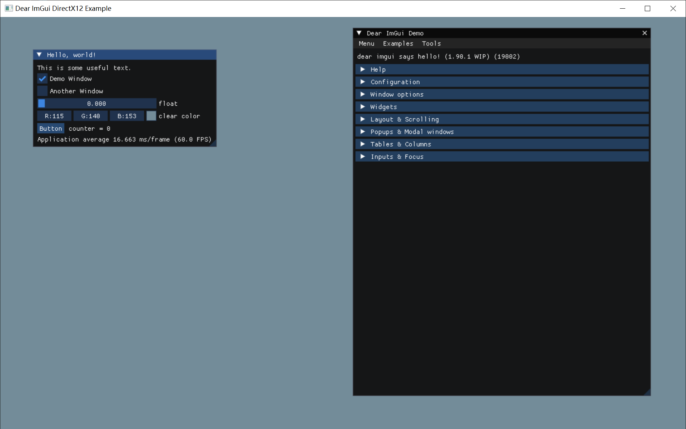

🌻Imgui-demo
This is a simple demo for imgui with different language

official_full_functionality_demo

# Python Bindding ([Dearpygui](https://github.com/hoffstadt/DearPyGui))
## Demo


# [Imgui](https://github.com/ocornut/imgui) (c++ implementation on windos platform)

## Build 
```shell
cd imgui
./build.bat
./build/Debug/my-demo.exe
```
## Demo
